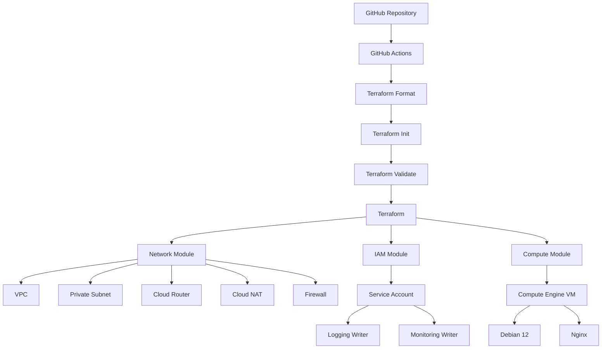

# Terraform GCP Infrastructure

[](https://github.com/Manojgangula20/terraform-gcp-infrastructure/actions/workflows/terraform.yml)

Modular Infrastructure-as-Code project for provisioning a secure,
private GCP environment using Terraform, with reusable GitHub Actions
CI.

## Overview

This project demonstrates how to design and manage Google Cloud
infrastructure using Terraform modules and automated CI checks through
GitHub Actions.

The infrastructure is organized into reusable modules for:

-   VPC networking
-   Subnetting
-   Cloud Router
-   Cloud NAT
-   Firewall rules
-   IAM service accounts
-   Compute Engine

The GitHub Actions pipeline provides automated Terraform formatting,
initialization, and validation on pull requests and pushes to `main`.

## Architecture



## Infrastructure Components

### Network Module

Creates:

-   Custom VPC
-   Private subnet
-   Cloud Router
-   Cloud NAT
-   Firewall rules

The VPC uses:

``` hcl
auto_create_subnetworks = false
```

This provides explicit control over subnet creation.

The Compute Engine instance does not receive a public external IP. Cloud
NAT provides outbound internet connectivity for resources in the private
subnet.

### IAM Module

Creates a dedicated service account for the Compute Engine instance.

The service account receives:

-   `roles/logging.logWriter`
-   `roles/monitoring.metricWriter`

This follows a least-privilege approach for application and
infrastructure observability.

### Compute Module

Creates a Compute Engine VM with:

-   Debian 12
-   `e2-micro`
-   10 GB balanced persistent disk
-   Private subnet placement
-   Dedicated service account
-   Nginx installation through a startup script

## Repository Structure

``` text
.
├── .github/
│   └── workflows/
│       ├── terraform.yml
│       └── terraform-reusable.yml
│
├── environments/
│   └── dev/
│       ├── main.tf
│       ├── outputs.tf
│       ├── terraform.tfvars.example
│       ├── variables.tf
│       ├── versions.tf
│       └── .terraform.lock.hcl
│
├── modules/
│   ├── network/
│   │   ├── main.tf
│   │   ├── outputs.tf
│   │   └── variables.tf
│   │
│   ├── iam/
│   │   ├── main.tf
│   │   ├── outputs.tf
│   │   └── variables.tf
│   │
│   └── compute/
│       ├── main.tf
│       ├── outputs.tf
│       └── variables.tf
│
├── .gitignore
├── LICENSE
└── README.md
```

## Terraform Design

The `dev` environment composes the infrastructure modules:

``` text
environments/dev
       |
       +---- network module
       |
       +---- IAM module
       |
       +---- compute module
```

This separation makes the infrastructure easier to maintain and allows
the modules to be reused by additional environments in the future.

## GitHub Actions

The project uses a reusable GitHub Actions workflow.

### Workflow

``` text
Pull Request / Push to main
             |
             v
      Terraform Format
             |
             v
      Terraform Init
             |
             v
     Terraform Validate
             |
             v
          Success
```

The reusable workflow accepts:

-   `terraform_directory`
-   `run_plan`

The plan step is currently optional and disabled in the default CI
workflow.

This allows the same workflow to be reused for additional Terraform
environments without duplicating CI logic.

## Validation

Terraform configuration was validated locally using:

``` bash
terraform fmt -recursive
terraform init -input=false
terraform validate
```

The configuration was also tested with Terraform planning.

The infrastructure configuration produced a Terraform plan containing:

``` text
9 to add
0 to change
0 to destroy
```

The planned resources included:

-   VPC
-   Subnet
-   Cloud Router
-   Cloud NAT
-   Firewall
-   Service Account
-   IAM bindings
-   Compute Engine VM

## CI Status

GitHub Actions successfully runs the Terraform CI workflow for changes
pushed to `main`.

The CI pipeline currently validates the Terraform configuration without
requiring cloud credentials.

## Security Considerations

This project intentionally avoids committing cloud credentials or
service-account JSON keys to the repository.

Terraform variable files containing local configuration are ignored by
Git:

``` text
*.tfvars
```

Only the example configuration is committed:

``` text
terraform.tfvars.example
```

Terraform state and plan files are also excluded from source control.

## Deployment

To use the project with a GCP project:

1.  Authenticate to Google Cloud.
2.  Configure the target GCP project.
3.  Create a local `terraform.tfvars`.
4.  Initialize Terraform.
5.  Review the Terraform plan.
6.  Apply the infrastructure.

Example:

``` bash
cd environments/dev

cp terraform.tfvars.example terraform.tfvars

terraform init

terraform plan

terraform apply
```

## Current Cloud Limitation

The Terraform configuration has been validated and successfully planned
locally.

Full provisioning of the GCP Compute/network resources requires a GCP
project with billing enabled and the required Google Cloud APIs
available.

The development GCP project used during testing did not have an
available billing account, so the full infrastructure deployment could
not be completed.

This limitation does not affect the Terraform module design or GitHub
Actions validation workflow.

## Future Improvements

Planned improvements include:

-   GCP Workload Identity Federation for GitHub Actions
-   Automated Terraform plan on pull requests
-   Controlled Terraform apply after merge
-   Remote Terraform state using GCS
-   Additional staging and production environments
-   Policy and security checks
-   Infrastructure testing
-   Cost estimation in CI

## Technologies

-   Terraform
-   Google Cloud Platform
-   Compute Engine
-   VPC
-   Cloud NAT
-   Cloud Router
-   IAM
-   GitHub Actions
-   YAML
-   HCL
-   Linux

## Key Engineering Concepts Demonstrated

-   Infrastructure as Code
-   Modular Terraform architecture
-   Private cloud networking
-   IAM and service accounts
-   Cloud NAT
-   Infrastructure automation
-   Reusable CI/CD workflows
-   Terraform validation
-   Git-based infrastructure management
-   Security-conscious credential handling

## License

MIT License
