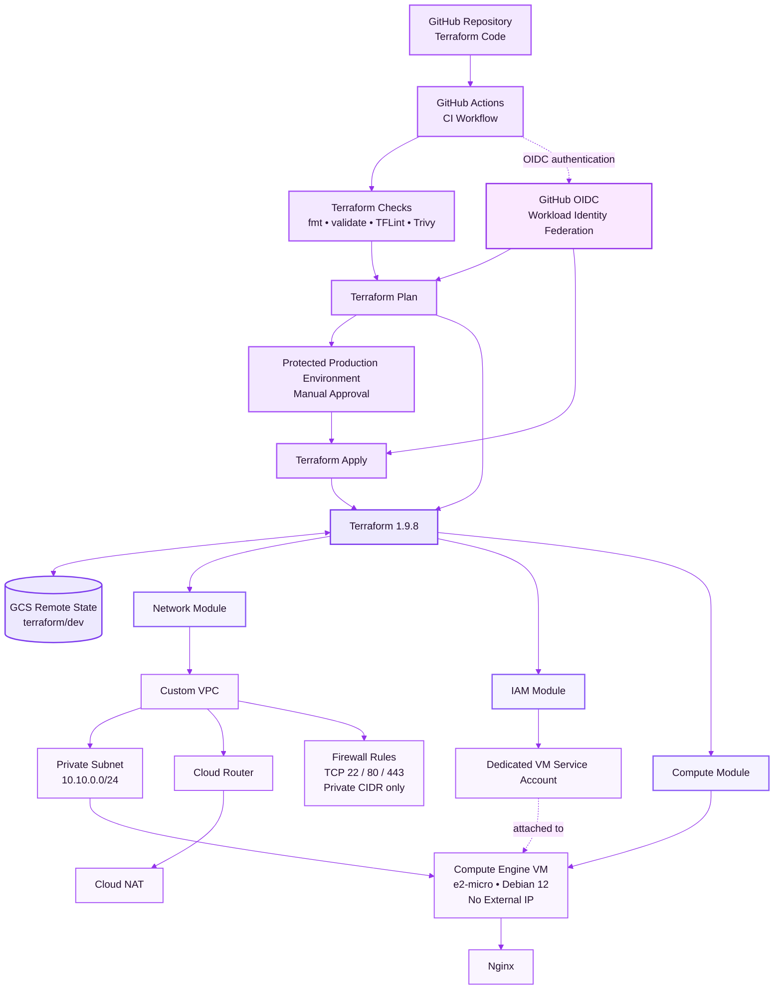

# Terraform GCP Infrastructure

> **Production-style Terraform infrastructure on GCP with modular IaC, private networking, remote state, GitHub Actions CI/CD, OIDC/WIF authentication, and controlled deployments.**

[](https://github.com/Manojgangula20/terraform-gcp-infrastructure/actions/workflows/terraform.yml)
[](https://www.terraform.io/)
[](https://cloud.google.com/)
[](https://github.com/features/actions)


## What This Project Demonstrates

This project is a hands-on implementation of a production-style Terraform workflow on Google Cloud, covering both infrastructure provisioning and CI/CD automation.

### Highlights

- Modular Terraform architecture for networking, IAM, and compute
- Private GCP infrastructure with no public IP on the VM
- Cloud NAT for controlled outbound internet access
- Remote Terraform state stored in GCS
- GitHub Actions reusable workflow for Terraform CI
- GitHub OIDC with Workload Identity Federation for keyless GCP authentication
- Automated Terraform plan and validation
- TFLint and Trivy security/configuration scanning
- Protected environment for controlled Terraform apply
- Verified deployment with Terraform state and GCP resources

## Overview

This project demonstrates how to design, provision, validate, and manage a secure private Google Cloud environment using **Terraform** and **GitHub Actions**.

The infrastructure is built with reusable Terraform modules and includes:

- Custom VPC networking
- Private subnet
- Cloud Router
- Cloud NAT
- Firewall rules
- Dedicated IAM service account
- Compute Engine VM
- Remote Terraform state in Google Cloud Storage
- GitHub Actions CI using reusable workflows
- GitHub OIDC / Workload Identity Federation for GCP authentication
- Controlled Terraform apply with a protected GitHub Environment

---

## Why This Project Matters

This project demonstrates practical cloud and DevOps engineering rather than only Terraform syntax.

It covers the complete infrastructure lifecycle:

**Design → Provision → Validate → Plan → Approve → Deploy → Manage State**

The implementation combines Terraform modules, private GCP networking, IAM, remote state, GitHub Actions, OIDC-based authentication, security scanning, and controlled deployments into a single reproducible workflow.

## Architecture


### Deployment flow

```text
Pull Request / Push to main
          |
          v
   GitHub Actions
          |
          +--> Terraform fmt
          +--> Terraform init
          +--> Terraform validate
          +--> TFLint
          +--> Trivy config scan
          +--> Terraform plan
          |
          v
   Protected Apply Workflow
          |
          v
 GitHub production approval
          |
          v
   Terraform Apply
          |
          v
      GCP Resources
```
### Authentication Flow

```text
GitHub Actions
      |
      | OIDC Token
      v
Google Cloud Workload Identity Federation
      |
      v
Terraform GitHub Service Account
      |
      v
Terraform
      |
      +--> GCP Infrastructure
      |
      +--> GCS Remote State
```
---

## Infrastructure Components

### Network Module

Creates:

- Custom VPC
- Private subnet
- Cloud Router
- Cloud NAT
- Firewall rules

The VPC uses:

```hcl
auto_create_subnetworks = false
```

This provides explicit control over subnet creation.

The Compute Engine instance has **no external IP address**. Cloud NAT provides outbound internet connectivity for resources in the private subnet.

### IAM Module

Creates a dedicated service account for the Compute Engine instance.

The VM service account receives:

- `roles/logging.logWriter`
- `roles/monitoring.metricWriter`

This keeps observability permissions scoped to the workload rather than using broad project-level permissions.

### Compute Module

Creates a Compute Engine VM with:

- Debian 12
- `e2-micro`
- 10 GB balanced persistent disk
- Private subnet placement
- Dedicated service account
- No public external IP
- Nginx installation through a startup script

---

## Remote Terraform State

Terraform state is stored remotely in **Google Cloud Storage** rather than committed to Git.

```text
GCS Bucket
terraform-state-25139972221
        |
        +-- terraform/dev/default.tfstate
```

Backend configuration:

```hcl
terraform {
  backend "gcs" {
    bucket = "terraform-state-25139972221"
    prefix = "terraform/dev"
  }
}
```

The state bucket uses:

- Uniform bucket-level access
- Object versioning
- Dedicated storage permissions for the Terraform GitHub service account

This provides a shared and durable state location for CI/CD.

---

### Backend Bootstrap

The GCS backend was provisioned and successfully used during the project
deployment and validation.

After completing the deployment, verification, and infrastructure lifecycle
testing, the GCP resources and Terraform state bucket were intentionally
destroyed to avoid ongoing cloud costs.

To recreate the environment, first create a GCS bucket and update
`environments/dev/backend.tf` with the new bucket name before running:

```bash
terraform init
```

The backend configuration is retained in the repository to document the
remote-state architecture used by the project.


## GitHub Actions CI/CD

The repository uses a **reusable GitHub Actions workflow** so Terraform validation logic can be shared across environments.

### CI checks

The workflow performs:

1. Terraform formatting check
2. Terraform initialization
3. Terraform validation
4. TFLint
5. Trivy Terraform configuration scan
6. Terraform plan
7. Plan artifact upload

The workflow is triggered by:

- Pull requests affecting Terraform or workflow files
- Pushes to `main`
- Manual workflow dispatch

### Reusable workflow inputs

The reusable workflow accepts:

- `terraform_directory`
- `project_id`
- `run_plan`
- `enable_gcp_auth`
- `workload_identity_provider`
- `service_account`

This allows the same CI logic to be reused for additional Terraform environments.

---

## GitHub Actions CI/CD

The repository uses a reusable GitHub Actions workflow so Terraform
validation logic can be shared across environments.

### CI checks

...

### Reusable workflow inputs

...

## CI/CD Status

The GitHub Actions workflows were successfully tested during the project
deployment lifecycle, including Terraform validation, planning, OIDC-based
GCP authentication, and controlled Terraform apply.

After completing the deployment exercise, the cloud infrastructure and
Terraform state bucket were intentionally destroyed to avoid ongoing costs.

The workflows remain in the repository and can be reactivated by recreating
the required GCP backend and authentication resources.

## Secure GitHub → GCP Authentication

The project uses GitHub OIDC with Google Cloud Workload Identity Federation
instead of storing a long-lived GCP service-account JSON key in GitHub.


## Secure GitHub → GCP Authentication

The project uses **GitHub OIDC with Google Cloud Workload Identity Federation** instead of storing a long-lived GCP service-account JSON key in GitHub.

```text
GitHub Actions
      |
      | OIDC token
      v
Workload Identity Federation
      |
      v
GCP Terraform Service Account
      |
      v
Terraform
```

The identity provider is restricted to the repository:

```text
Manojgangula20/terraform-gcp-infrastructure
```

This removes the need to store static cloud credentials in GitHub Secrets.

---

## Controlled Terraform Apply

Infrastructure changes are separated from routine CI validation.

The apply workflow:

1. Authenticates to GCP using Workload Identity Federation
2. Initializes Terraform
3. Creates a Terraform plan
4. Stores the exact plan as a short-lived artifact
5. Waits for approval through the protected `production` GitHub Environment
6. Applies the approved plan

This creates a safer deployment path than automatically applying every push to `main`.

---

## Repository Structure

```text
.
├── .github/
│   └── workflows/
│       ├── terraform.yml
│       ├── terraform-reusable.yml
│       └── terraform-apply.yml
│
├── environments/
│   └── dev/
│       ├── backend.tf
│       ├── main.tf
│       ├── outputs.tf
│       ├── terraform.tfvars.example
│       ├── variables.tf
│       ├── versions.tf
│       └── .terraform.lock.hcl
│
├── modules/
│   ├── network/
│   │   ├── main.tf
│   │   ├── outputs.tf
│   │   └── variables.tf
│   │
│   ├── iam/
│   │   ├── main.tf
│   │   ├── outputs.tf
│   │   └── variables.tf
│   │
│   └── compute/
│       ├── main.tf
│       ├── outputs.tf
│       └── variables.tf
│
├── .gitignore
├── .tflint.hcl
├── LICENSE
└── README.md
```

---

## Terraform Design

The `dev` environment composes the infrastructure modules:

```text
environments/dev
       |
       +---- network module
       |
       +---- IAM module
       |
       +---- compute module
```

This separation keeps infrastructure concerns isolated and allows the modules to be reused by additional environments.

---

## Validation

The configuration is validated locally and in CI using:

```bash
terraform fmt -recursive
terraform init -input=false
terraform validate
terraform plan
```

Additional static analysis:

```text
TFLint
Trivy configuration scan
```

The infrastructure was successfully provisioned and verified in GCP.

Current Terraform state contains **9 managed resources**, including:

- VPC
- Subnet
- Cloud Router
- Cloud NAT
- Firewall
- Service Account
- IAM bindings
- Compute Engine VM

A final local plan returned:

```text
No changes. Your infrastructure matches the configuration.
```

---

## Deployment Verification

The deployed environment was independently verified in GCP.

### Compute

```text
VM:        terraform-demo-vm
Machine:   e2-micro
Status:    RUNNING
Zone:      asia-south1-a
Private IP: 10.10.0.2
```

### Networking

```text
VPC:       terraform-demo-vpc
Subnet:    terraform-demo-subnet
CIDR:      10.10.0.0/24
NAT:       terraform-demo-vpc-nat
```

The VM remains private and uses Cloud NAT for outbound internet access.

---

## Security Considerations

This project intentionally avoids committing cloud credentials or service-account JSON keys to the repository.

Terraform variable files containing local configuration are ignored by Git:

```text
*.tfvars
```

Only the example configuration is committed:

```text
terraform.tfvars.example
```

Terraform state and plan files are excluded from source control.

Additional security controls include:

- GitHub OIDC instead of static GCP credentials
- Repository-restricted Workload Identity Federation
- Private VM without an external IP
- Dedicated VM service account
- Scoped logging and monitoring permissions
- Protected GitHub Environment for production apply
- Short-lived Terraform plan artifact

---

## Technologies

- Terraform
- Google Cloud Platform
- Compute Engine
- VPC
- Cloud Router
- Cloud NAT
- IAM
- Google Cloud Storage
- GitHub Actions
- Workload Identity Federation
- OIDC
- TFLint
- Trivy
- YAML
- HCL
- Linux

---

## Key Engineering Concepts Demonstrated

- Infrastructure as Code
- Modular Terraform architecture
- Private cloud networking
- Remote Terraform state
- Cloud NAT
- IAM and service accounts
- GitHub OIDC authentication
- Workload Identity Federation
- Reusable CI/CD workflows
- Terraform plan/apply separation
- Protected deployments
- Infrastructure validation
- Static security scanning
- Git-based infrastructure management
- Security-conscious credential handling

---

## Project Results

| Area | Result |
|---|---|
| Terraform Resources | 9 managed resources |
| Compute | `e2-micro` Debian 12 VM |
| VM Networking | Private IP only |
| VPC | Custom VPC |
| NAT | Cloud NAT enabled |
| Remote State | GCS backend |
| CI/CD | GitHub Actions |
| Authentication | OIDC / Workload Identity Federation |
| Security Scanning | TFLint + Trivy |
| Deployment | Protected Terraform Apply |
| Final Terraform Plan | No changes |


## Future Improvements

Potential next steps:

- Add staging and production Terraform environments
- Add policy-as-code checks
- Add automated infrastructure testing
- Add cost estimation to pull requests
- Tighten Workload Identity conditions to specific branches/environments
- Add monitoring dashboards and alerting
- Introduce drift detection
- Add automated `terraform destroy` workflows for ephemeral environments

---
